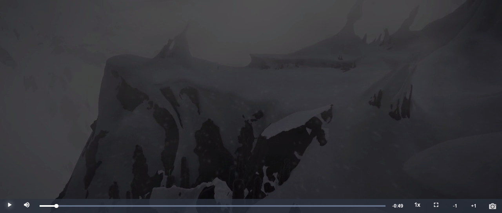

# videojs-shoot

### Demo

 
### Usage
```js
<script src="shoot.js"></script>

var player = videojs("video", {
  controls: true,
  autoplay: true,
  preload: 'auto',
  plugins: {
    shoot :{}
  } 
});
```
